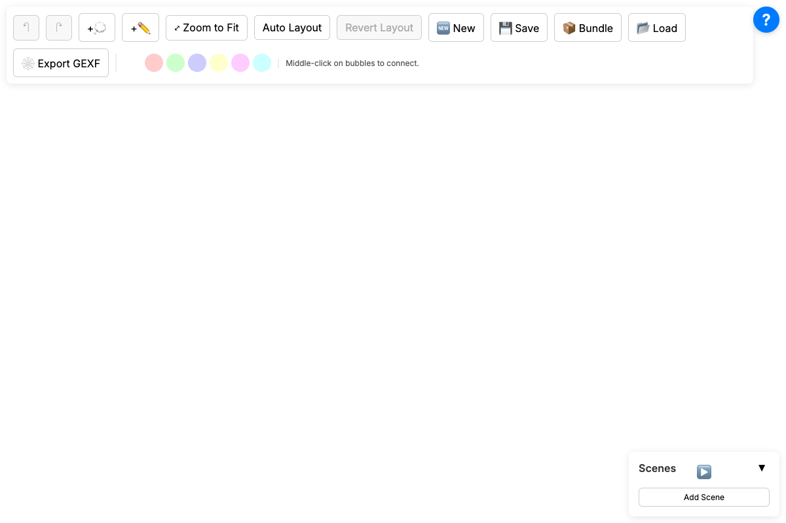

# Mind Mapper

A simple, web-based mind mapping application built with Vanilla JavaScript and Vite.



## Features

- **Visual Mind Maps**: Create bubbles, text annotations, and images (drag & drop supported).
- **Interactive Connections**: Connect bubbles by middle-clicking or Shift-clicking.
- **Scene Management**: Create sequences of views ("Scenes") for presentations, with custom delays and transitions.
- **Animated Walkthroughs**: Play back scenes to tell a story or present an idea.
- **Persistence**: automatically saves to local storage. Import/Export to JSON.
- **JSON Storage**: Save and load your maps as JSON files for backup or sharing.
- **Quine Mode**: "Bundle" the entire application and your map into a single self-contained HTML file that can be shared and opened offline.
- **GEXF Export**: Export your graph structure for analysis in tools like Gephi.

## Getting Started

### Prerequisites

- Node.js (v16+)
- npm

### Installation

1. Clone the repository:
   ```bash
   git clone https://github.com/brianbrewington/mindmapper.git
   ```
2. Install dependencies:
   ```bash
   cd mindmapper
   npm install
   ```

### Usage

Start the development server:

```bash
npm run dev
```

Open your browser to the URL shown (usually `http://localhost:5173`).

### Building for Production

To build the application for deployment (creates a `dist` directory):

```bash
npm run build
```

To preview the production build locally:

```bash
npm run preview
```

### Running Tests

To run the unit test suite (using Vitest):

```bash
npm test
```


### Controls

| Action | Control |
|--------|---------|
| **Pan** | Left-click drag on canvas |
| **Zoom** | Mouse Scroll |
| **Add Bubble** | Double-click canvas or press `B` |
| **Connect** | Middle-click drag between bubbles (or Shift-click) |
| **Context Menu** | Right-click on element |
| **Delete** | Select + `Delete`/`Backspace` |
| **Undo/Redo** | `Ctrl+Z` / `Ctrl+Y` |

## Project Structure

- `src/model`: Core logic and state management.
- `src/view`: Canvas rendering and UI components.
- `src/controller`: Input handling (mouse/keyboard).
- `src/io`: Persistence and file handling.

## Developer Guide

We follow a strict **Test-Driven Development (TDD)** workflow to ensure stability and prevent regressions.

### Best Practices

1.  **Red-Green-Refactor**:
    *   **Red**: Write a failing test for the new feature or bug fix *first*.
    *   **Green**: Write the minimal code necessary to make the test pass.
    *   **Refactor**: Clean up the code while ensuring tests stay green.
2.  **Mocking**: Use `vitest` mocks for dependencies (Renderer, InputHandler) to isolate unit logic. Avoid relying on global state in unit tests.
3.  **Pre-commit Hook**:
    *   We use `husky` to run `scripts/pre-commit.sh` before every commit.
    *   This script runs the **full test suite** and the **production build**.
    *   **Do not bypass this hook** (e.g., avoid `git commit --no-verify`) unless absolutely necessary.
4.  **Running Tests**:
    *   `npm test`: Runs Vitest in watch mode (for development).
    *   `npm run test:run`: Runs all tests once (used by CI/Hooks).
5.  **Artifacts**: Keep `task.md` and `implementation_plan.md` updated in the `brain` directory (if using the AI assistant workflow).

### Key Commands

- **Verify All**: `./scripts/pre-commit.sh` - Runs tests and build manually.

## License

ISC
